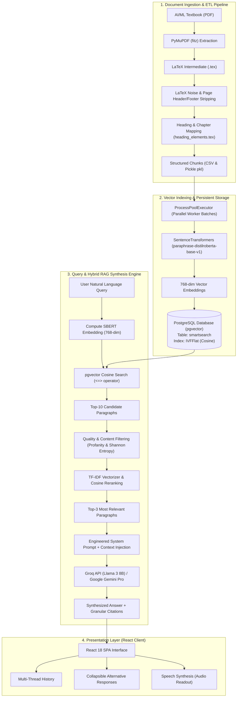
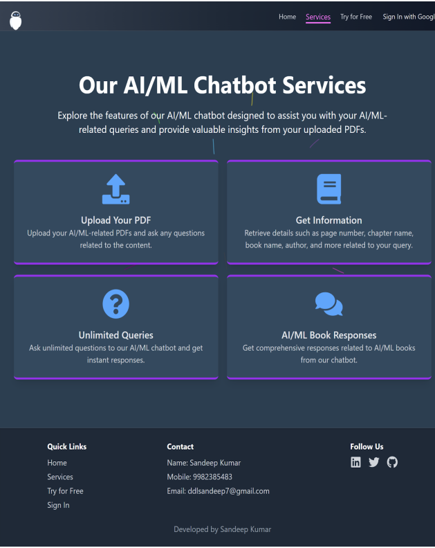
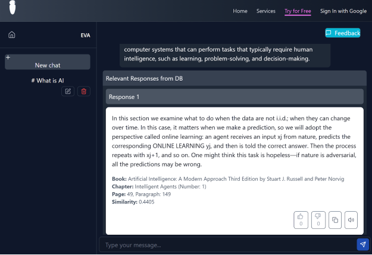
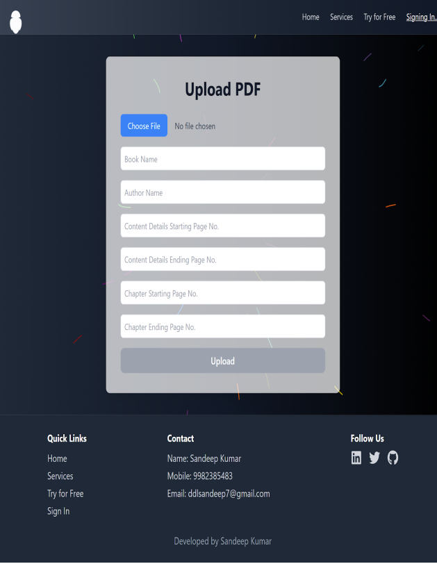

# 🧠 AI/ML Book Interaction ChatBot (EVE)

<div align="center">

[](https://www.python.org/)
[](https://react.dev/)
[](https://flask.palletsprojects.com/)
[](https://github.com/pgvector/pgvector)
[](https://huggingface.co/sentence-transformers/paraphrase-distilroberta-base-v1)
[](https://groq.com/)
[](https://ai.google.dev/)
[](https://firebase.google.com/)
[](https://www.gnu.org/licenses/gpl-3.0)

**An intelligent, multi-stage RAG (Retrieval-Augmented Generation) platform for uploading, parsing, indexing, and semantically interacting with foundational Artificial Intelligence & Machine Learning textbooks.**

[Key Features](#-key-features) • [Architecture Overview](#️-architecture-overview) • [Approach & Methodology](#-approach--methodology) • [Implementation Details](#-technical-implementation-details) • [Quickstart & Setup](#-quickstart--setup-guide) • [Pre-Indexed Knowledge Base](#-pre-indexed-knowledge-base) • [Screenshots](#-visual-showcase) • [Team](#-team--contributors)

</div>

---

## 📘 Project Overview

**AI/ML Book Interaction ChatBot (codename: EVE)** is an end-to-end full-stack platform engineered to bridge the gap between static, dense AI/ML literature and interactive learning. Users can upload comprehensive textbooks in PDF format, extract semantic document hierarchies via an automated LaTeX-driven ETL pipeline, index high-dimensional vector embeddings into PostgreSQL with `pgvector`, and converse with an AI agent powered by **Groq (Llama 3 8B)** and **Google Gemini Pro**.

Unlike generic RAG implementations that blindly split documents by character count, EVE implements **structure-aware parsing** with heading, chapter, page, and paragraph tracking. Every generated answer is paired with alternative citations, exact page/paragraph coordinates, similarity confidence metrics, and interactive text-to-speech audio playback.

---

## ✨ Key Features

- **Document Structure-Aware PDF Extraction**: Multi-stage ETL pipeline that converts raw PDFs to structured LaTeX, strips noise, parses chapter/section hierarchies, and yields clean, paragraph-level records.
- **High-Throughput Parallel Ingestion**: Multi-core batch vectorization via Python's `ProcessPoolExecutor` using SBERT `paraphrase-distilroberta-base-v1` (768 dimensions).
- **Persistent Vector Database with pgvector**: Stores vector embeddings and scalar book metadata in PostgreSQL, accelerated with `IVFFlat` index structures (`vector_cosine_ops`).
- **Hybrid Retrieval & Quality Guardrails**: Combines vector cosine distance search with regex content moderation, Shannon entropy random string detection, and TF-IDF lexical reranking.
- **Dual LLM Context Synthesis**: Blazing-fast inference via Groq's Llama 3 8B engine and Google Gemini Pro fallback, governed by a strict system persona ("EVA").
- **Granular Source Attribution & Alternative Answers**: Returns top synthesized answers accompanied by interactive alternative passages with author, textbook, chapter, page number, paragraph index, and similarity scores.
- **Modern Full-Stack React Experience**: Built with React 18, Tailwind CSS, Aceternity UI background animations, multi-thread chat management, and Firebase Google OAuth sign-in.
- **Accessibility & Utility**: Built-in Text-to-Speech (TTS) engine, one-click clipboard copying, and user feedback capture.

---

## 🏗️ Architecture Overview

The system operates across three decoupled layers: **Document Ingestion (ETL)**, **Vector Store & Hybrid RAG Engine**, and the **Interactive Frontend Client**.

### Component Flow



---

## ⚙️ Approach & Methodology

### 1. Structure-Aware ETL Scraping Pipeline
Standard PDF extraction tools collapse complex two-column academic layouts and lose vital reading order. EVE implements a specialized 5-phase extraction pipeline (`scraping_pipeline.py`):
- **Phase 1 (Extract)**: Converts page ranges to intermediate LaTeX format using PyMuPDF (`fitz`), preserving verbatim blocks and inline spacing.
- **Phase 2 (Transform - Syntax Sanitization)**: Strips LaTeX container boilerplate (`\documentclass`, `\usepackage`, `\begin{document}`, `\begin{verbatim}`) using regular expressions.
- **Phase 3 (Transform - Page & Noise Cleanup)**: Eliminates repeated dots (table of contents leaders), standalone page numbering, external web hyperlinks, and running headers.
- **Phase 4 (Transform - Topic & Chapter Alignment)**: Ingests `heading_elements.tex` to identify chapter boundaries and topic transitions, automatically binding each paragraph to its parent chapter name and number.
- **Phase 5 (Load)**: Produces tabular datasets exported to `.csv` and serialized `.pkl` formats containing author, book name, chapter number, page, paragraph, text, and topic.

### 2. High-Performance Parallel Batch Embedding
Textbook ingestion involves processing tens of thousands of paragraphs:
- **Model Choice**: `paraphrase-distilroberta-base-v1` from the Sentence-Transformers library maps sentences and paragraphs to a 768-dimensional dense vector space tuned for semantic similarity.
- **Multiprocessing**: Ingestion leverages Python's `concurrent.futures.ProcessPoolExecutor` utilizing all available CPU cores (`multiprocessing.cpu_count()`) to chunk and vectorize inputs in batches of 1,000 items.
- **Bulk Database Ingestion**: Uses `psycopg2.extras.execute_values` for high-throughput single-transaction bulk inserts into PostgreSQL.

### 3. Persistent Vector Storage with pgvector & IVFFlat Indexing
Vector representations and scalar metadata are persisted to an enterprise-grade relational database:
- **Schema Design**: The `smartsearch` table unifies scalar attributes (`book_author`, `book_name`, `book_url`, `chapter_name`, `chapter_number`, `page`, `paragraph`, `text`, `topic`) with a native vector column: `embedding vector(768)`.
- **Indexing Strategy**: Uses an `IVFFlat` inverted file index using vector cosine distance operations:
  ```sql
  CREATE INDEX IF NOT EXISTS embedding_idx ON smartsearch USING ivfflat (embedding vector_cosine_ops);
  ```
  This guarantees sub-second approximate nearest neighbor (ANN) retrieval over massive corpus sizes.

### 4. Hybrid Reranking & Quality Guardrails
Retrieved vector matches undergo multi-stage refinement before reaching the language model:
1. **Cosine Vector Distance Query**:
   ```sql
   SELECT *, 1 - (embedding <=> %s::vector) AS similarity
   FROM smartsearch
   ORDER BY embedding <=> %s::vector
   LIMIT 10;
   ```
2. **Content Moderation & Anomaly Detection**:
   - Regular expression pattern checks for profanity and repeated characters.
   - **Shannon Entropy Filter (`is_random_string`)**: Measures unique character entropy over text length to discard malformed OCR artifacts or random strings (`entropy > 0.8`).
3. **Lexical Reranking (TF-IDF)**:
   - Scikit-learn's `TfidfVectorizer` computes lexical overlap between the user question and the filtered candidate paragraphs.
   - Cosine similarity ranking selects the top 3 paragraphs for context construction.

### 5. Prompt Engineering & Dual LLM Synthesis
The top 3 validated paragraphs are assembled with metadata markers and injected into the prompt:
- **Primary Engine**: **Groq Cloud API** running `llama3-8b-8192` for rapid, low-latency token generation.
- **Secondary Engine**: **Google Gemini Pro** (`gemini-pro`) via `google.generativeai` for deep contextual analysis.
- **System Persona ("EVA")**: Strictly instructs the model to provide concise, factual explanations grounded strictly in the provided textbook passages, avoiding hallucinations and speculation.

### 6. Interactive Frontend & Accessibility Layer
The user interface (`frontend/`) delivers a responsive, modern environment:
- **Sidebar Thread Manager**: Supports switching between chat sessions, creating new threads, and renaming/deleting conversations.
- **Alternative Response Cards**: Collapsible drawers display all 3 retrieved textbook passages, with book title, author, chapter, page, paragraph, and similarity percentage.
- **Web Speech API**: In-browser Text-to-Speech (`window.speechSynthesis`) enables users to listen to retrieved textbook excerpts aloud.
- **Firebase OAuth**: Google Sign-In popups protect upload routes while offering instant guest chat access.

---

## 🛠️ Technical Implementation Details

The following core modules drive the end-to-end architecture:

| Component | File Path | Primary Responsibilities |
| :--- | :--- | :--- |
| **ETL Document Pipeline** | `backend/scraping_pipeline.py` | PyMuPDF extraction, LaTeX sanitization, chapter/heading identification, noise reduction, and CSV/Pickle data generation. |
| **Database Initialization** | `backend/initialize_db.py` | Automatically creates `vector` extension, sets up `smartsearch` schema, generates IVFFlat indices, and bulk indexes all pre-loaded CSV books. |
| **Core Backend Server** | `backend/app.py` | Flask REST API, SBERT model inference, pgvector retrieval, entropy guardrails, TF-IDF reranking, Groq/Gemini synthesis, and PDF upload handler. |
| **Lightweight Query Service** | `backend/app1.py` | Standalone semantic search service with threshold filtering (`similarity > 0.5`) for direct paragraph queries. |
| **Chat State & Logic Hook** | `frontend/src/components/useChat.jsx` | Manages message history, thread switching, backend API calls, loading shimmer states, and metadata parsing. |
| **Interactive Chat Components**| `frontend/src/components/ChatComponents.jsx`| Chat thread management, collapsible alternative answer cards, TTS speech synthesis, and feedback modal. |
| **PDF Upload Portal** | `frontend/src/Pages/UploadPDF.js` | Form validation for book title, author, and page boundary offsets; file upload with progress feedback. |
| **Authentication Module** | `frontend/src/Firebase.js` | Google OAuth provider integration via Firebase Authentication SDK. |

---

## 📸 Visual Showcase

### 1. Interactive Services & Landing Page
Showcases platform capabilities, features, and one-click Google Sign-In.



### 2. AI-Powered Chat Interface
Real-time conversational interface with thread management, synthesized responses, and expandable alternative passages.



### 3. PDF Upload & Ingestion Portal
Allows users to upload custom AI/ML textbooks and configure starting/ending page ranges for chapters and content.



---

## 📚 Pre-Indexed Knowledge Base

The repository includes curated tabular datasets for iconic, foundational AI and Machine Learning literature in `books/`:

| Dataset / Book Title | Key Authors | Focus Area |
| :--- | :--- | :--- |
| **Artificial Intelligence: A Modern Approach** | Stuart Russell & Peter Norvig | Foundations of AI, Search, Logic, Planning & Agents |
| **Pattern Recognition and Machine Learning** | Christopher M. Bishop | Bayesian Methods, Graphical Models, Neural Networks |
| **The Elements of Statistical Learning** | Hastie, Tibshirani, & Friedman | Statistical Learning, Regularization, Trees, SVMs |
| **Machine Learning** | Tom M. Mitchell | Core Machine Learning Theory & Concept Learning |
| **Math for AI: Basics of Linear Algebra** | Machine Learning Mastery | Matrix Operations, Vector Spaces, Eigenvalues |
| **Big Data SMACK Architecture** | Raúl Estrada | Apache Spark, Mesos, Akka, Cassandra, and Kafka |
| **ML Interview Questions & Answers** | Community Curated | Core ML, Deep Learning & Applied AI Interview Prep |
| **AI/ML Topics & Keywords Taxonomies** | Subject Curated | Domain Ontology, Concept Graphs & Topic Hierarchies |

---

## 🚀 Quickstart & Setup Guide

### 1. Prerequisites

- **Python**: Version 3.8 to 3.11+
- **Node.js**: Version 18.0.0+ and `npm`
- **PostgreSQL**: PostgreSQL 14+ with the [pgvector extension](https://github.com/pgvector/pgvector) installed
- **API Keys**:
  - [Groq Cloud API Key](https://console.groq.com/)
  - [Google Gemini API Key](https://aistudio.google.com/) (optional/fallback)
  - Firebase Project Credentials (for Google OAuth)

---

### 2. Database Configuration

Ensure PostgreSQL is running and your target database has `pgvector` available:

```sql
-- Connect to your PostgreSQL database:
CREATE DATABASE smartsearch_db;
\c smartsearch_db;

-- Enable the vector extension:
CREATE EXTENSION IF NOT EXISTS vector;
```

---

### 3. Backend Setup

1. **Navigate to the backend directory**:
   ```bash
   cd backend
   ```

2. **Create and activate a virtual environment**:
   ```bash
   # On macOS/Linux:
   python3 -m venv venv
   source venv/bin/activate

   # On Windows (PowerShell):
   python -m venv venv
   .\venv\Scripts\Activate.ps1
   ```

3. **Install dependencies**:
   ```bash
   pip install -r requirements.txt
   ```

4. **Configure Environment Variables**:
   Create a `.env` file in `backend/`:
   ```env
   # PostgreSQL Connection
   DB_HOST=localhost
   DB_NAME=smartsearch_db
   DB_USER=postgres
   DB_PASSWORD=your_postgres_password
   DB_PORT=5432

   # LLM Provider Keys
   GROQ_API_KEY=your_groq_api_key_here
   GEMINI_API_KEY=your_gemini_api_key_here
   ```

5. **Initialize Database & Ingest Benchmark Books**:
   ```bash
   python initialize_db.py
   ```
   *(This creates the table, builds the IVFFlat cosine index, and vectorizes the CSV files).*

6. **Start the Flask Server**:
   ```bash
   python app.py
   ```
   The backend API will start on `http://127.0.0.1:3002`.

---

### 4. Frontend Setup

1. **Navigate to the frontend directory**:
   ```bash
   cd ../frontend
   ```

2. **Install Node dependencies**:
   ```bash
   npm install
   ```

3. **Configure Firebase Authentication**:
   Verify your Firebase credentials in `src/Firebase.js`:
   ```javascript
   const firebaseConfig = {
     apiKey: "YOUR_API_KEY",
     authDomain: "YOUR_AUTH_DOMAIN",
     projectId: "YOUR_PROJECT_ID",
     storageBucket: "YOUR_STORAGE_BUCKET",
     messagingSenderId: "YOUR_MESSAGING_SENDER_ID",
     appId: "YOUR_APP_ID"
   };
   ```

4. **Launch the Development Server**:
   ```bash
   npm start
   ```
   Open your browser at `http://localhost:3000`.

---

## 💻 Running & Interacting with the Application

### Option A: Asking AI/ML Technical Queries
1. Open `http://localhost:3000` and click **"Try for Free"** to enter the Chat Interface.
2. Enter questions such as:
   - *"Explain the trade-off between bias and variance according to Bishop."*
   - *"How does the Bellman equation define optimal state-value functions in Russell & Norvig?"*
   - *"What is the kernel trick in Support Vector Machines?"*
   - *"Compare Ridge and Lasso regression shrinkage methods."*
3. **Inspect the Result**:
   - Read the synthesized response from **EVA**.
   - Expand the **Alternative Responses** accordions to view the exact passage, author, book title, chapter, page number, and similarity score.
   - Click the 🔊 **Speaker** icon to listen to the text read aloud.
   - Click the 📋 **Copy** icon to copy excerpts directly to your clipboard.

### Option B: Ingesting a New Textbook (PDF)
1. Sign in via **Google Sign-In** on the landing page or navigate to `/upload`.
2. Select any standard textbook or research PDF.
3. Fill in the metadata parameters:
   - **Book Name**: *e.g., Deep Learning*
   - **Author Name**: *e.g., Ian Goodfellow, Yoshua Bengio, Aaron Courville*
   - **Content Starting Page & Ending Page**: Page range containing the actual body.
   - **Chapter Starting Page & Ending Page**: Page range containing the Table of Contents.
4. Click **Upload**. The backend ETL pipeline will extract, structure, and index the document, automatically redirecting you to the chat interface once completed.

---

## 📁 Repository Structure

```
AI_ML_Chatbot/
├── backend/
│   ├── app.py                     # Main Flask server (SBERT, pgvector, Groq Llama 3, Gemini)
│   ├── app1.py                    # Lightweight standalone query API service
│   ├── initialize_db.py           # Database migration & parallel CSV ingestion script
│   ├── scraping_pipeline.py       # Multi-stage PDF to LaTeX ETL parser
│   ├── heading_elements.tex       # Heading taxonomy & chapter extraction rules
│   ├── requirements.txt           # Python backend dependencies
│   ├── uploads/                   # Temporary storage for incoming PDF uploads
│   └── testing.ipynb              # Jupyter notebook for experimental testing & validation
├── books/                         # Curated pre-indexed textbook knowledge base
│   ├── AI_Russell_Norvig.csv
│   ├── Pattern_Recognition_and_Machine_Learning.csv
│   ├── The_Elements_of_Statistical_Learning.csv
│   ├── Machine_Learning.csv
│   ├── Book - Math for AI - Basics of Linear Algebra.csv
│   ├── Book Big Data SMACK.csv
│   ├── ML Interview Questions - Sheet1.csv
│   └── AI_ML_Topics_Keywords.csv
├── frontend/                      # React 18 Single Page Application
│   ├── public/                    # Static web assets & index.html
│   ├── src/
│   │   ├── components/
│   │   │   ├── ChatComponents.jsx # Threads, cards, TTS audio, feedback form
│   │   │   ├── Services.js        # Feature highlight component
│   │   │   ├── SignIn.js          # Google sign-in modal
│   │   │   ├── useChat.jsx        # Custom hook for chat state & API handling
│   │   │   └── ui/                # Radix UI / Shadcn / Aceternity UI components
│   │   ├── Pages/
│   │   │   ├── ChatInterface.jsx  # Main interactive chat workspace
│   │   │   ├── MainContent.js     # Hero landing page with animated typing
│   │   │   ├── UploadPDF.js       # Structured book upload portal
│   │   │   ├── Header.js          # Navigation header
│   │   │   └── Footer.js          # Application footer
│   │   ├── Firebase.js            # Firebase SDK configuration
│   │   ├── App.js                 # React Router v7 route definitions
│   │   ├── index.js               # React entrypoint
│   │   └── index.css              # Global styles & Tailwind directives
│   ├── package.json               # Frontend dependencies & proxy definition
│   └── tailwind.config.js         # Tailwind CSS styling configuration
├── screenshots/                   # Application screenshots
│   ├── services_page.png
│   ├── chat_interface.png
│   └── pdf_upload.png
├── LICENSE                        # GNU General Public License v3
└── README.md                      # Project documentation & Architecture guide
```

---

## 👥 Team & Contributors

- **Vivek Kumar** ([GitHub](https://github.com/VIVEK342004) • [LinkedIn](https://www.linkedin.com/in/vivek342004/))  
  *Core Contributor & Maintainer*  
  - 📞 **Mobile**: `+91 8979261332`  
  - ✉️ **Email**: `vivekkumar04034@gmail.com`  
  - 🌐 **GitHub**: [github.com/VIVEK342004](https://github.com/VIVEK342004)  
  - 💼 **LinkedIn**: [linkedin.com/in/vivek342004](https://www.linkedin.com/in/vivek342004/)

### Founding Contributors & Research Team
Developed by students from **Sitare University** under the academic guidance of **Dr. Kushal Shah**:

- **Satyam Kumar Pandey** ([GitHub](https://github.com/satyampandey1411) • [LinkedIn](https://www.linkedin.com/in/satyam1411pandey/))  
  *Project Lead* — Machine Learning architecture, data pipelines, model integration, and system design.
- **Rajat Malviya**  
  *Data & Backend Engineer* — Database schemas, pgvector search pipelines, API design, and ETL automation.
- **Sandeep Kumar**  
  *Frontend Developer* — React UI/UX design, Tailwind/Aceternity animations, component engineering, and Firebase OAuth.

---

## 📄 License

This project is licensed under the **GNU General Public License v3.0**. See the [LICENSE](LICENSE) file for complete details.

---

## 🙏 Acknowledgements

- [Sentence-Transformers](https://sbert.net/) for dense text representation models.
- [Groq Cloud](https://groq.com/) for lightning-fast Llama 3 inference.
- [Google Generative AI](https://ai.google.dev/) for Gemini model APIs.
- [pgvector](https://github.com/pgvector/pgvector) for open-source vector similarity search in PostgreSQL.
- [PyMuPDF](https://pymupdf.readthedocs.io/) for fast, robust PDF text extraction.
- [Aceternity UI](https://ui.aceternity.com/) & [Tailwind CSS](https://tailwindcss.com/) for modern UI components.

<div align="center">
  <sub>Engineered with precision for AI/ML students, researchers, and practitioners.</sub>
</div>
